Forecast daily bike rental demand using time series models
================
Luca Albertini

## Data Description

The dataset contains the daily count of rental bike transactions between
01/2011 and 12/2012 in the Capital bikeshare system with the
correpsonding weather and seasonal information **Data Source:**
<https://archive.ics.uci.edu/ml/datasets/bike+sharing+dataset>

## Goal of the Project

A bike rental company aims to improve its demand forecasting accuracy to
optimize its fleet managment and pricing strategy. The goal is to
determine the optimal number of bikes to keep in every dock station and
to set a dynamic changing price based on the predicted demand. There are
3 main targets: - Describe data to answer key questions to uncover
insights. - Build well-validated time series models for forecasting
future rental bikes demand. - Propose a dynamic pricing strategy based
on demands movements due to different variables.

## Load and Explore the Data

Prior to start it is necessary to set the working directory, load the
required packages and build some useful functions.

``` r
#function # count mild outliers
find_mild_out <- function(X) {
  iqr = IQR(X)
  lowerq = quantile(X)[2]
  upperq = quantile(X)[4]
  lowmildborder = lowerq - (iqr*1.5)
  upmildborder = upperq + (iqr*1.5)
  print(mild_outliers <- length(which( X > upmildborder | X < lowmildborder)))
}
# function to count severe outliers
find_severe_out <- function(X) {
  iqr = IQR(X)
  lowerq = quantile(X)[2]
  upperq = quantile(X)[4]
  lowsevborder = lowerq - (iqr*3)
  upsevborder = upperq + (iqr*3)
  print(severe_outliers <- length(which( X > upsevborder | X < lowsevborder)))
}
#function to replace outliers with avg
rem_out <- function(c){
  b <- boxplot(c, plot = FALSE)
  s1 <- c
  s1[which(c %in% b$out)] <- mean(c[which(! c %in% b$out)],na.rm=TRUE)
  return(s1)
}
```

Once done this preliminary operation, it is time to load the data frame.

``` r
## load day aggregate daya
day = read.csv("in_data/day.csv", header =  TRUE, sep = ",")
```

Data is aggregated on a daily basis. Take a quick glance to data.

``` r
#glimpse(day) to see more details about the data
## display the first and last 3 obs of the table
head(day, 3)
```

    ##   instant     dteday season yr mnth holiday weekday workingday weathersit
    ## 1       1 2011-01-01      1  0    1       0       6          0          2
    ## 2       2 2011-01-02      1  0    1       0       0          0          2
    ## 3       3 2011-01-03      1  0    1       0       1          1          1
    ##       temp    atemp      hum windspeed casual registered  cnt
    ## 1 0.344167 0.363625 0.805833  0.160446    331        654  985
    ## 2 0.363478 0.353739 0.696087  0.248539    131        670  801
    ## 3 0.196364 0.189405 0.437273  0.248309    120       1229 1349

``` r
tail(day, 3)
```

    ##     instant     dteday season yr mnth holiday weekday workingday weathersit
    ## 729     729 2012-12-29      1  1   12       0       6          0          2
    ## 730     730 2012-12-30      1  1   12       0       0          0          1
    ## 731     731 2012-12-31      1  1   12       0       1          1          2
    ##         temp    atemp      hum windspeed casual registered  cnt
    ## 729 0.253333 0.242400 0.752917  0.124383    159       1182 1341
    ## 730 0.255833 0.231700 0.483333  0.350754    364       1432 1796
    ## 731 0.215833 0.223487 0.577500  0.154846    439       2290 2729

Rename and label the variables to make them easier to understand.

``` r
## rename some variables to make them clearer
names(day)[names(day) == "instant"] <- "index"
names(day)[names(day) == "dteday"] <- "date"
names(day)[names(day) == "yr"] <- "year"
names(day)[names(day) == "mnth"] <- "month"
names(day)[names(day) == "weathersit"] <- "weather"
names(day)[names(day) == "atemp"] <- "temp_feel"
names(day)[names(day) == "hum"] <- "humidity"
names(day)[names(day) == "cnt"] <- "trb"
#transform dates into date format
day$date <- as.Date(day$date)
## add lables
#day
day <- day %>%
  apply_labels (season = "1winter;2spring;3summer;4fall",
                        year= "0=2011;1=2012",
                        workingday = "1=yes",
                        temp = "normalized temperature",
                        temp_feel = "perceived temperature",
                        casual = "count of casual users",
                        registered = "count of registered users",
                        trb = "count of total rental bikes")
```

The df contains 731 observations of 16 variables. This are 2 years, with
1 leap year, of observations.

#### Exploratory Statistics

To have an understanding of the data, let’s compute some general
stastics about the 3 different user’s types.

``` r
daystat <- describe(day[,c("casual","registered","trb")], IQR = TRUE)
daystas <- data.frame(daystat)
kable(daystat, digits = 2)
```

|            | vars |   n |    mean |      sd | median | trimmed |     mad | min |  max | range |  skew | kurtosis |    se |    IQR |
|:-----------|-----:|----:|--------:|--------:|-------:|--------:|--------:|----:|-----:|------:|------:|---------:|------:|-------:|
| casual     |    1 | 731 |  848.18 |  686.62 |    713 |  744.95 |  587.11 |   2 | 3410 |  3408 |  1.26 |     1.29 | 25.40 |  780.5 |
| registered |    2 | 731 | 3656.17 | 1560.26 |   3662 | 3641.72 | 1712.40 |  20 | 6946 |  6926 |  0.04 |    -0.72 | 57.71 | 2279.5 |
| trb        |    3 | 731 | 4504.35 | 1937.21 |   4548 | 4517.19 | 2086.02 |  22 | 8714 |  8692 | -0.05 |    -0.82 | 71.65 | 2804.0 |

Build a df named “users” with minimum and maximum values for casual
rides, registered rides and total rides.

``` r
users <- data.frame(max(day$casual), max(day$registered), max(day$trb),
                    min(day$casual), min(day$registered), min(day$trb))
users
```

    ##   max.day.casual. max.day.registered. max.day.trb. min.day.casual.
    ## 1            3410                6946         8714               2
    ##   min.day.registered. min.day.trb.
    ## 1                  20           22

Add some columns to the original df. In particular:

- **regvstot**: how much rides in a day were registered rides respect to
  the total rides of that day \* 100
- **perreg**: max-scaling (value/max) of registered rides
- **pertrb**: max-scaling of total rides
- **percas**: max-scaling of casual rides

``` r
#reg rides/total rides * 100
day$regvstot <- (day$registered / day$trb)*100
day <- day %>%
  apply_labels (regvstot = "% of reg vs the total users")
#max-scaling reg
day$perreg <- day$registered / max(day$registered)
day <- day %>%
  apply_labels (perreg = "% respect the max registered")
#max-scaling trb
day$pertrb <- day$trb / max(day$trb)
day <- day %>%
  apply_labels (pertrb = "% respect the max total rides")
#max-scaling cas
day$percas <- day$casual / max(day$casual)
day <- day %>%
  apply_labels (percas = "% respect the max casuals")
```

Finally, some exploratory stastics for the entire df.

``` r
summary(day)
```

    ##      index            date                season           year       
    ##  Min.   :  1.0   Min.   :2011-01-01   Min.   :1.000   Min.   :0.0000  
    ##  1st Qu.:183.5   1st Qu.:2011-07-02   1st Qu.:2.000   1st Qu.:0.0000  
    ##  Median :366.0   Median :2012-01-01   Median :3.000   Median :1.0000  
    ##  Mean   :366.0   Mean   :2012-01-01   Mean   :2.497   Mean   :0.5007  
    ##  3rd Qu.:548.5   3rd Qu.:2012-07-01   3rd Qu.:3.000   3rd Qu.:1.0000  
    ##  Max.   :731.0   Max.   :2012-12-31   Max.   :4.000   Max.   :1.0000  
    ##      month          holiday           weekday        workingday   
    ##  Min.   : 1.00   Min.   :0.00000   Min.   :0.000   Min.   :0.000  
    ##  1st Qu.: 4.00   1st Qu.:0.00000   1st Qu.:1.000   1st Qu.:0.000  
    ##  Median : 7.00   Median :0.00000   Median :3.000   Median :1.000  
    ##  Mean   : 6.52   Mean   :0.02873   Mean   :2.997   Mean   :0.684  
    ##  3rd Qu.:10.00   3rd Qu.:0.00000   3rd Qu.:5.000   3rd Qu.:1.000  
    ##  Max.   :12.00   Max.   :1.00000   Max.   :6.000   Max.   :1.000  
    ##     weather           temp           temp_feel          humidity     
    ##  Min.   :1.000   Min.   :0.05913   Min.   :0.07907   Min.   :0.0000  
    ##  1st Qu.:1.000   1st Qu.:0.33708   1st Qu.:0.33784   1st Qu.:0.5200  
    ##  Median :1.000   Median :0.49833   Median :0.48673   Median :0.6267  
    ##  Mean   :1.395   Mean   :0.49538   Mean   :0.47435   Mean   :0.6279  
    ##  3rd Qu.:2.000   3rd Qu.:0.65542   3rd Qu.:0.60860   3rd Qu.:0.7302  
    ##  Max.   :3.000   Max.   :0.86167   Max.   :0.84090   Max.   :0.9725  
    ##    windspeed           casual         registered        trb      
    ##  Min.   :0.02239   Min.   :   2.0   Min.   :  20   Min.   :  22  
    ##  1st Qu.:0.13495   1st Qu.: 315.5   1st Qu.:2497   1st Qu.:3152  
    ##  Median :0.18097   Median : 713.0   Median :3662   Median :4548  
    ##  Mean   :0.19049   Mean   : 848.2   Mean   :3656   Mean   :4504  
    ##  3rd Qu.:0.23321   3rd Qu.:1096.0   3rd Qu.:4776   3rd Qu.:5956  
    ##  Max.   :0.50746   Max.   :3410.0   Max.   :6946   Max.   :8714  
    ##     regvstot         perreg             pertrb             percas         
    ##  Min.   :48.97   Min.   :0.002879   Min.   :0.002525   Min.   :0.0005865  
    ##  1st Qu.:78.52   1st Qu.:0.359488   1st Qu.:0.361717   1st Qu.:0.0925220  
    ##  Median :85.12   Median :0.527210   Median :0.521919   Median :0.2090909  
    ##  Mean   :82.44   Mean   :0.526371   Mean   :0.516909   Mean   :0.2487321  
    ##  3rd Qu.:90.07   3rd Qu.:0.687662   3rd Qu.:0.683498   3rd Qu.:0.3214076  
    ##  Max.   :98.68   Max.   :1.000000   Max.   :1.000000   Max.   :1.0000000

#### In-depth Statistics

Compute statistics about number of total rides grouped by other
variables. In particular, it will grouped byr year, season, month,
working day and weather.

``` r
#year
year <- subset(data.frame(aggregate(day$trb  ~ day$year, FUN = mean), aggregate(day$trb  ~ day$year, FUN = sum)),
              select = -day.year.1)
colnames(year) <- c("year", "avg", "total")
year
```

    ##   year      avg   total
    ## 1    0 3405.762 1243103
    ## 2    1 5599.934 2049576

``` r
## season
szn <- subset(data.frame(aggregate(day$trb  ~ day$season, FUN = mean), aggregate(day$trb  ~ day$season, FUN = sum)),
                  select = -day.season.1)
colnames(szn) <- c("season", "avg", "total")
szn
```

    ##   season      avg   total
    ## 1      1 2604.133  471348
    ## 2      2 4992.332  918589
    ## 3      3 5644.303 1061129
    ## 4      4 4728.163  841613

``` r
## month
mth <- subset(data.frame(aggregate(day$trb  ~ day$month, FUN = mean), aggregate(day$trb  ~ day$month, FUN = sum)),
                  select = -day.month.1)
colnames(mth) <- c("month", "avg", "total")
mth
```

    ##    month      avg  total
    ## 1      1 2176.339 134933
    ## 2      2 2655.298 151352
    ## 3      3 3692.258 228920
    ## 4      4 4484.900 269094
    ## 5      5 5349.774 331686
    ## 6      6 5772.367 346342
    ## 7      7 5563.677 344948
    ## 8      8 5664.419 351194
    ## 9      9 5766.517 345991
    ## 10    10 5199.226 322352
    ## 11    11 4247.183 254831
    ## 12    12 3403.806 211036

``` r
## workingday
wdy <- subset(data.frame(aggregate(day$trb  ~ day$workingday, FUN = mean), aggregate(day$trb  ~ day$workingday, FUN = sum)),
              select = -day.workingday.1)
colnames(wdy) <- c("workingday", "avg", "total")
wdy
```

    ##   workingday      avg   total
    ## 1          0 4330.169 1000269
    ## 2          1 4584.820 2292410

``` r
## weather
wth <- subset(data.frame(aggregate(day$trb  ~ day$weather, FUN = mean), aggregate(day$trb  ~ day$weather, FUN = sum)),
              select = -day.weather.1)
colnames(wth) <- c("weather", "avg", "total")
wth
```

    ##   weather      avg   total
    ## 1       1 4876.786 2257952
    ## 2       2 4035.862  996858
    ## 3       3 1803.286   37869

To visualize differences among periods, let’s plot the respective
boxplots:

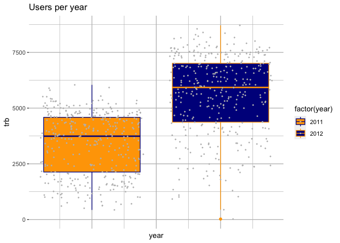<!-- -->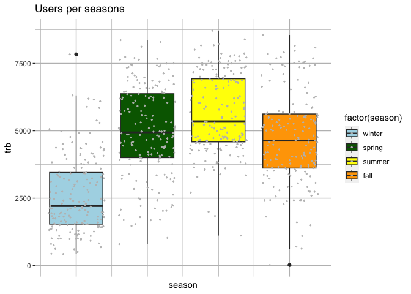<!-- -->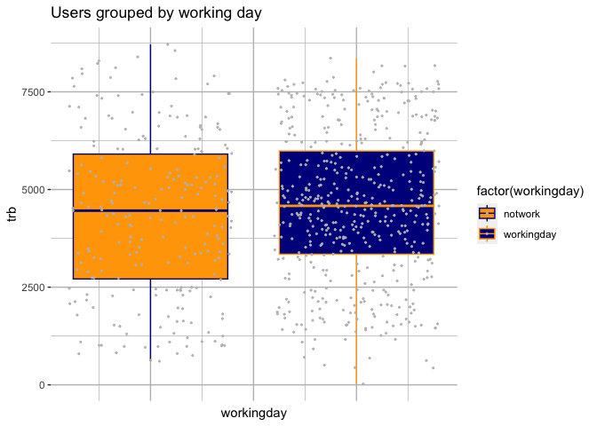<!-- -->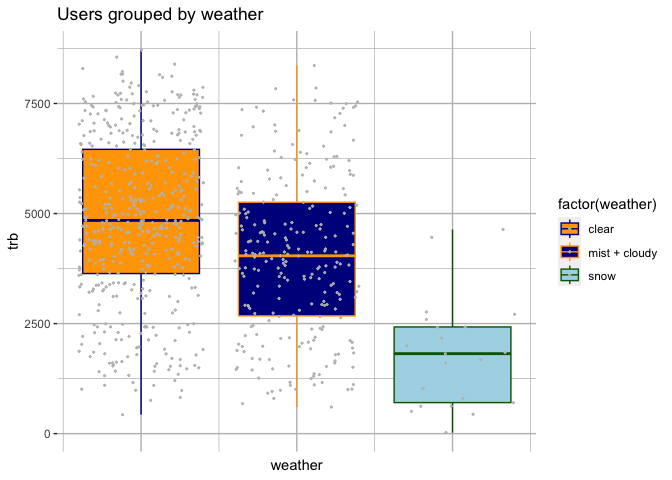<!-- -->

To obtain an idea of possible relations between variables, a scatterplot
may help. Let’s consider total bike rides against temperature.

<!-- -->

The scatterplot suggest a small positive relation between temperature
and trb. This in line with the common idea that the warmer the weather,
the more likely people will ride bikes. Scatterplots of total rides
against humidity and total rides against wind speed provide even more
information.

<!-- --><!-- -->

Within both of these charts the points are distributed without following
some sort of linear relation. Interestingly, bike rides tend to cluster
in the areas where wind speed is lower and where humidity is higher. Be
aware that these are just raw insights. To properly identify this kind
of relation it is necessary to model the data.

## Plot the variables

Plotting time series variables is a fundemantal step in every
forecasting analysis. Through charts, it would be possible to discover
more information about the nature of the time series. To perform this
task the most useful packages are “timetk” and “zoo”. Firstly, let’s
transform the variables into ts object. Then, plot the variable the
study is interested into.

``` r
#transform data into time series
casts <- zoo(day$casual, seq(from = as.Date("2011-01-01"), to = as.Date("2012-12-31"), by = 1))
regts <- zoo(day$registered, seq(from = as.Date("2011-01-01"), to = as.Date("2012-12-31"), by = 1))
trbts <- zoo(day$trb, seq(from = as.Date("2011-01-01"), to = as.Date("2012-12-31"), by = 1))
```

Now casual, registered and trb are ts objects that go from 01/01/2011 to
12/31/2012.

#### Weather related variables

Plot weather-related variables to gain a general understanding of the
situation:

- Temperature vs perceived temperature

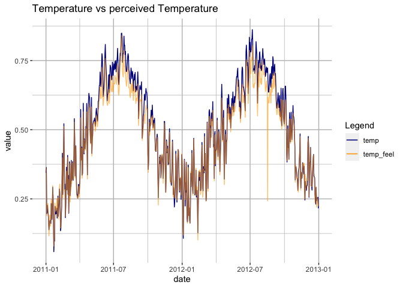<!-- -->

As predictable, temperature shows some seasonal patterns. Moreover, the
perceived temperature resembles (less or more) the temperature, except
for one point that should be investigated more.

- Humidity plot

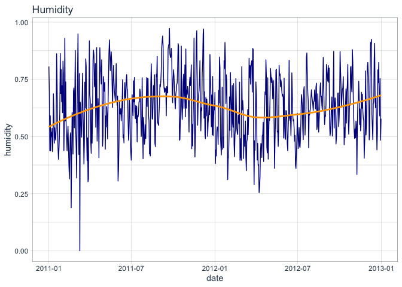<!-- -->

Humidity does not display neither some trend nor some sort of
seasonality. Yet it shows an extremly low value (possible outlier)
around 2011-03-10.

- Wind speed plot

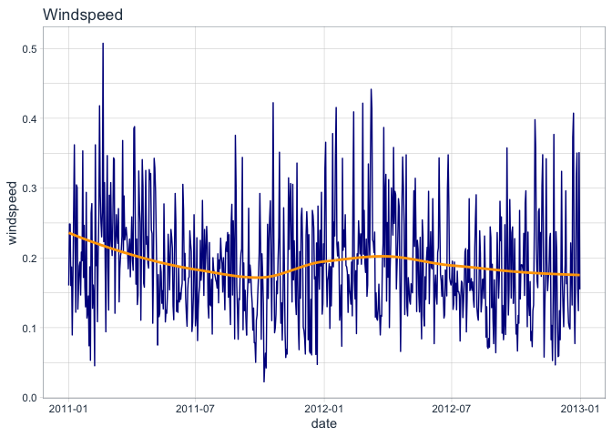<!-- -->

Wind speed does not show neither some trend nor some sort of
seasonality. It may be useufl to investigate more for outliers.

#### Usage-related variables

The usage-related variables are registered rides, casual rides andtotal
rides. Note that the total rides are the sum of the casual and
registered rides.

- Casual rides plots

<!-- -->

Plotting by dividing per year and highlighting different seasons.

<!-- -->

The plot suggest a slight increase in casual users in the second year.
Ts may have a seasonality component.

- Registered rides plots

<!-- -->

Plotting by dividing per year and highlighting different seasons.

<!-- -->

Registered users experienced an increased by the beggining of the second
year (2012). Overall, there may be seasonality even in this ts.

- Total rides plot

<!-- -->

Plotting by dividing per year and highlighting different seasons.

<!-- -->

Total rides increased in 2012. Plots above suggest that this is a
consequence of the sharp increase in the registered users for the same
year. Likely, data is seasonal with a frequency of 365. Probably this
series is of the additive (trend+seasonality) type.

- Scaled variables plot

<!-- --><!-- --><!-- --><!-- -->

## Focuse on Total users

The focus will now be shifted only to the number of total rides since
the main goal of the research is to predict its future values. Let’s
perform a seasonal analysis on this ts.

<!-- -->

As this chart highlights, data has some outliers.It is fundamental to
deal with these points prior to start forecasting.

<!-- -->

The charts highlight the presence of 7 outliers, amongst which 4 are
severe. These values must be examined later and, if needed, replaced.
The function tsclean() will do exactly that.

<!-- -->

Now there are no-more sever outliers. 3 outliers have not been removed,
yet it seems reasonal to keep them since they are neither computing
error nor so much far away from the other observation (i.e 2 of them are
in the alpha 0.05 border and the thrid one is really close). As such,
this “corrected” trb time series will be the one analyzed. Note that
even the registered and casuals users time series have been smoothed for
outliers, in case they may be needed later on.

## Smoothing time series

Smoothing time series is a method to reveal underlying trends and
identify components that a ts may have. Its aim is to reduce the noise
to emphasize signals. Both exponential and moving average techniques
will be employed.

#### Moving Averages

The most widespread techniques to smooth time series is to employ moving
averages. In this specific case, moving averages at 90, 30 and 7 days
will be employed with the aim to reduce noise and spot some features of
the total rides amount.

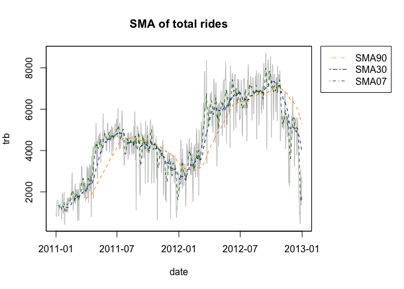<!-- -->

As predictable, the 7-days SMA still embeds some noise. However, both
the 30-day and 90-days SMA help in understanding the path of total
rides. Users experiences an upward trend from the begging of the year to
few months after July, then they usually start to decrease. What is more
striking, however, is the sharp upward trend in the period that goes
from March/April to July both in 2011 and 2012. In raw terms, this chart
suggests that may be a good idea to increase prices in these period in
order to increase earnings, while may be useful to decrease price during
the downturn in rides in order to attract more customer **Note**. The
data seems to display a 365 day period seasonality. However, the time
spawn is to short to assess this. There may be the necessity to enlarge
the focus and include more years to effectively understand this.

Exponential Moving Averages, which apply more weight to more recent
data, confirm the insights above.

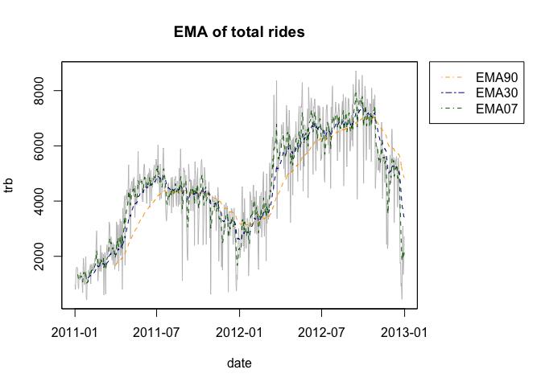<!-- -->

#### Exponential smoothing (Holt Winters)

Exponential smoothing consists in a smoothing tecnhique that assigns
exponentially decreasing weights over time. It is alpha’s value that
express the base value, and the higher it is the higher the emphasis on
more recent observation. Parameters beta and gamma, instead, refer
respectively to the trend value and the seasonal component. Even a
seasonal HW will be considered.

``` r
par(mfrow = c(1,1))
#if the coeff is closed to zero, it may means that forecast may be bases on seasonality in general
trbHw1 <- HoltWinters(trbc_ts, gamma = FALSE, l.start = 985)
trbHw2 <- HoltWinters(trbc_ts, beta = FALSE, gamma = FALSE, l.start = 985)
trbHw3 <- HoltWinters(trbc_ts, seasonal = "additive", l.start = 985)
#calculate the sum of the squared errors for the insample forecast errors
#i.e the erros for the time period covered by the original ts
trbHw1$SSE
```

    ## [1] 581533431

``` r
trbHw2$SSE
```

    ## [1] 565439186

``` r
trbHw3$SSE
```

    ## [1] 292671488

Plot the results of the Holt Winter models

<!-- -->

The HW models catch nicely the total rides movements. They succeed in
reducing daily noise and confirm the pattern spotted above. To really
smooth the time series, however, it is possible to play alpha and set it
to a lower value (such as 0.1). The seasonal one (green line) is the one
that display more oscillations and issues, since in the first point it
goes below zero.

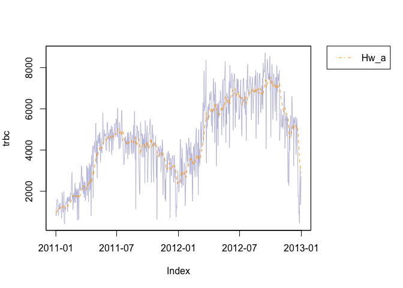<!-- -->

The orange line is now smoother. Again, this confirm the insights form
the moving averages.

## Stationarity

Understand if a time series is stationary is fundamental in the choice
of model’s parameters. Indeed, some model require stationary ts, while
others work even with non-stationary ts. There are several test that
look for stationarity and/or the presence of a unit root. Here, the
Augmented Dickey Fueller test, the KPSS test, the PP test and a test for
the unit root variance ratio will be implemented. Prior to perform these
tests, let’s plot the autocorrelation and partial autocorrelation plots
for the number of total users.

<!-- --><!-- -->

Overall, there is a strong correlation between subsequent observations.
However, it varies in its direction (from positive to negative and
viceversa). Particularly striking is the high correlation in the first
100 lags. The partial autocorrelation plots display a strong correlation
between the first observations too. After those, there are not so many
significant lags . Again, the direction of the autocorrelation varies.
These charts suggests the presence of an AR (the acf) and likely the
presence of a Moving average (MA).

The next step is to test for the presence of a Unit root. To do so, an
ADF test and a PP test will be performed. In both of these tests, the
null-hypothesis is the presence of a unit root.

``` r
#ADF
summary(ur.df(trbc, 
              type = "trend", 
              lags = 180, 
              selectlags = "BIC"))
```

    ## 
    ## ############################################### 
    ## # Augmented Dickey-Fuller Test Unit Root Test # 
    ## ############################################### 
    ## 
    ## Test regression trend 
    ## 
    ## 
    ## Call:
    ## lm(formula = z.diff ~ z.lag.1 + 1 + tt + z.diff.lag)
    ## 
    ## Residuals:
    ##     Min      1Q  Median      3Q     Max 
    ## -3795.6  -443.7   120.0   585.5  2931.4 
    ## 
    ## Coefficients:
    ##              Estimate Std. Error t value Pr(>|t|)    
    ## (Intercept) 245.42155  146.09875   1.680   0.0936 .  
    ## z.lag.1      -0.07295    0.03132  -2.329   0.0202 *  
    ## tt            0.24301    0.30183   0.805   0.4211    
    ## z.diff.lag1  -0.45731    0.04925  -9.286  < 2e-16 ***
    ## z.diff.lag2  -0.29194    0.04993  -5.847 8.67e-09 ***
    ## z.diff.lag3  -0.28380    0.04847  -5.855 8.26e-09 ***
    ## z.diff.lag4  -0.30339    0.04722  -6.425 2.90e-10 ***
    ## z.diff.lag5  -0.18785    0.04300  -4.368 1.50e-05 ***
    ## ---
    ## Signif. codes:  0 '***' 0.001 '**' 0.01 '*' 0.05 '.' 0.1 ' ' 1
    ## 
    ## Residual standard error: 930.7 on 542 degrees of freedom
    ## Multiple R-squared:  0.2539, Adjusted R-squared:  0.2443 
    ## F-statistic: 26.35 on 7 and 542 DF,  p-value: < 2.2e-16
    ## 
    ## 
    ## Value of test-statistic is: -2.3293 1.9768 2.8935 
    ## 
    ## Critical values for test statistics: 
    ##       1pct  5pct 10pct
    ## tau3 -3.96 -3.41 -3.12
    ## phi2  6.09  4.68  4.03
    ## phi3  8.27  6.25  5.34

``` r
#adf test, =/ command
adf.test(trbc)
```

    ## 
    ##  Augmented Dickey-Fuller Test
    ## 
    ## data:  trbc
    ## Dickey-Fuller = -1.3084, Lag order = 9, p-value = 0.871
    ## alternative hypothesis: stationary

``` r
#pp test
pp.test(trbc, type = "Z(alpha)") #stationarity
```

    ## 
    ##  Phillips-Perron Unit Root Test
    ## 
    ## data:  trbc
    ## Dickey-Fuller Z(alpha) = -146.1, Truncation lag parameter = 6, p-value
    ## = 0.01
    ## alternative hypothesis: stationary

``` r
pp.test(trbc, type = "Z(t_alpha") #stationarity
```

    ## 
    ##  Phillips-Perron Unit Root Test
    ## 
    ## data:  trbc
    ## Dickey-Fuller Z(t_alpha) = -9.0278, Truncation lag parameter = 6,
    ## p-value = 0.01
    ## alternative hypothesis: stationary

The results of the ADF points to the presence of unit roots. Yet, it
does not have a trend nor a drift. However, the PP test gives the
opposite results pointing to the absence of a unit root (i.e the ts is
stationary). To clear the doubts, a KPSS test will be performed. In this
case, the null-hypothesis is that the ts is trend stationary, while the
alternative is the presence of a unit root.

``` r
kpss.test(trbc, null = "Trend")#there is a unit root
```

    ## 
    ##  KPSS Test for Trend Stationarity
    ## 
    ## data:  trbc
    ## KPSS Trend = 0.51664, Truncation lag parameter = 6, p-value = 0.01

The results point to the presence of a unit root. Finally, a test for
unit roots variance ratio has been implemented.

``` r
bvr.test(trbc)
```

    ## 
    ##  Breitung Variance Ratio Test for a Unit Root
    ## 
    ## data:  trbc
    ## rho = 0.045541, p-value = 0.4451
    ## alternative hypothesis: stationary

The Bvr test highlights the presence of a unit root, yet the variance
(rho) is really close to the case of no unit root. This suggests that
this ts may become stationary if differentiated by 1 (i.e is a I(1) ts).
Let’s verify this.

``` r
#differentiate trb
diftrb <- diff(trbc, lag=1)
#adf1
summary(ur.df(diftrb, 
              type = "trend", 
              lags = 180, 
              selectlags = "BIC"))
```

    ## 
    ## ############################################### 
    ## # Augmented Dickey-Fuller Test Unit Root Test # 
    ## ############################################### 
    ## 
    ## Test regression trend 
    ## 
    ## 
    ## Call:
    ## lm(formula = z.diff ~ z.lag.1 + 1 + tt + z.diff.lag)
    ## 
    ## Residuals:
    ##     Min      1Q  Median      3Q     Max 
    ## -3906.7  -455.6   121.9   571.2  2906.0 
    ## 
    ## Coefficients:
    ##              Estimate Std. Error t value Pr(>|t|)    
    ## (Intercept)  53.62372  121.42170   0.442    0.659    
    ## z.lag.1      -2.72652    0.15124 -18.028  < 2e-16 ***
    ## tt           -0.15096    0.25210  -0.599    0.550    
    ## z.diff.lag1   1.20890    0.12893   9.376  < 2e-16 ***
    ## z.diff.lag2   0.86721    0.10245   8.465 2.41e-16 ***
    ## z.diff.lag3   0.54333    0.07435   7.308 9.78e-13 ***
    ## z.diff.lag4   0.20823    0.04231   4.921 1.14e-06 ***
    ## ---
    ## Signif. codes:  0 '***' 0.001 '**' 0.01 '*' 0.05 '.' 0.1 ' ' 1
    ## 
    ## Residual standard error: 935.4 on 542 degrees of freedom
    ## Multiple R-squared:  0.7195, Adjusted R-squared:  0.7164 
    ## F-statistic: 231.7 on 6 and 542 DF,  p-value: < 2.2e-16
    ## 
    ## 
    ## Value of test-statistic is: -18.0275 108.3348 162.5019 
    ## 
    ## Critical values for test statistics: 
    ##       1pct  5pct 10pct
    ## tau3 -3.96 -3.41 -3.12
    ## phi2  6.09  4.68  4.03
    ## phi3  8.27  6.25  5.34

``` r
#no unit root
#adf2
adf.test(diftrb)
```

    ## 
    ##  Augmented Dickey-Fuller Test
    ## 
    ## data:  diftrb
    ## Dickey-Fuller = -13.499, Lag order = 8, p-value = 0.01
    ## alternative hypothesis: stationary

``` r
#no unit root
#pp
pp.test(diftrb, type = "Z(alpha)")#stationarity
```

    ## 
    ##  Phillips-Perron Unit Root Test
    ## 
    ## data:  diftrb
    ## Dickey-Fuller Z(alpha) = -769.16, Truncation lag parameter = 6, p-value
    ## = 0.01
    ## alternative hypothesis: stationary

``` r
pp.test(diftrb, type = "Z(t_alpha")#stationarity
```

    ## 
    ##  Phillips-Perron Unit Root Test
    ## 
    ## data:  diftrb
    ## Dickey-Fuller Z(t_alpha) = -52.609, Truncation lag parameter = 6,
    ## p-value = 0.01
    ## alternative hypothesis: stationary

``` r
#kpss
kpss.test(diftrb, null = "Trend")
```

    ## 
    ##  KPSS Test for Trend Stationarity
    ## 
    ## data:  diftrb
    ## KPSS Trend = 0.021442, Truncation lag parameter = 6, p-value = 0.1

``` r
#trend stat
#bvr
bvr.test(diftrb)
```

    ## 
    ##  Breitung Variance Ratio Test for a Unit Root
    ## 
    ## data:  diftrb
    ## rho = 1.8723e-05, p-value = 0.001
    ## alternative hypothesis: stationary

``` r
#stationarity
```

These tests confirm the previous intuition. Once differentiate by lag 1,
trb becomes a stationary time series. Hence, the proper forecasting
model is ARIMA with d = 1.

## Forecasting and Testing

Decompose the ts in order to access its components.

``` r
componentstrb <- decompose(trbc_ts)
plot(componentstrb)
```

<!-- -->

Decomposing show both an increasing trend and a seasonality with a
frequency of 365 (yearly). Note that our series has just 2 seasons,
since it covers just 2011 and 2012. This may be a limitation that will
be discussed later. Prior to forecast employing an ARIMA model, it is
possible to forecast using the previous Holt Winters estimation. In this
case, the holt winter model that considers seasonality will be employed.

<!-- -->

The HW model suggests, as predictable, an high volatility in day-to-day
bike rides. It also points to a feeble positive trend in January 2013.

To accurately forecast future bike usage, an ARIMA model will be
employed. The first thing to do is to split the time series into
training and testing data. In this specific case, last month’s
observations (12/12) will be the testing data. This is reasonable since
the aim is to build a model that can forecast 31days ahead.

``` r
tr <- trbc_ts[1:700]
tt <- trbc_ts[701:730]
tr <- ts(data = tr, start = c(2011), frequency = 365)
tt <- ts(data = tt, start = c(2012, 335), frequency = 365)
```

Once split the data, it is necessary to determine the parameters for the
ARIMA model (p,D,q). Since the total bike rides is I(1), then D will be
equal to 1. Instead, to have an idea of p and q, the autocorrelogram and
the partial-autocorrelogram may help.

<!-- --><!-- -->

The acf is useful for the MA (q) part, while the pacf is useful for the
Ar(p) part. The spikes in acf points to q while the ones in pacf points
to p. According to these insights, p could be up to lag 6 while q can be
even larger. Remember that a common rule of thumb is to keep the model
as simple as possible. Yet, both the autocorrelation plots point to AR
and MA. Again, these are just insights.

Now an ARIMA model can be estimated. auto.arima will help in estimating
the parameters automatically

``` r
arima1 <- auto.arima(tr, d=1)
arima1
```

    ## Series: tr 
    ## ARIMA(1,1,1) 
    ## 
    ## Coefficients:
    ##          ar1      ma1
    ##       0.2780  -0.8812
    ## s.e.  0.0428   0.0184
    ## 
    ## sigma^2 = 708660:  log likelihood = -5699.51
    ## AIC=11405.01   AICc=11405.04   BIC=11418.66

However, this model is lacking of the seasonal components. Hence,
re-estimate a SARIMA model with the auto.arima command.

``` r
arima1s <- auto.arima(tr, d=1, D=1, trace = TRUE)
```

    ## 
    ##  Fitting models using approximations to speed things up...
    ## 
    ##  ARIMA(2,1,2)(0,1,0)[365]                    : 367.2875
    ##  ARIMA(0,1,0)(0,1,0)[365]                    : 493.022
    ##  ARIMA(1,1,0)(0,1,0)[365]                    : 439.6609
    ##  ARIMA(0,1,1)(0,1,0)[365]                    : 370.3496
    ##  ARIMA(1,1,2)(0,1,0)[365]                    : 364.6197
    ##  ARIMA(0,1,2)(0,1,0)[365]                    : 361.9953
    ##  ARIMA(0,1,3)(0,1,0)[365]                    : 361.8513
    ##  ARIMA(1,1,3)(0,1,0)[365]                    : 365.2878
    ##  ARIMA(0,1,4)(0,1,0)[365]                    : 363.8607
    ##  ARIMA(1,1,4)(0,1,0)[365]                    : 366.8737
    ## 
    ##  Now re-fitting the best model(s) without approximations...
    ## 
    ##  ARIMA(0,1,3)(0,1,0)[365]                    : 5667.1
    ## 
    ##  Best model: ARIMA(0,1,3)(0,1,0)[365]

``` r
arima1s
```

    ## Series: tr 
    ## ARIMA(0,1,3)(0,1,0)[365] 
    ## 
    ## Coefficients:
    ##           ma1      ma2      ma3
    ##       -0.6918  -0.0922  -0.0983
    ## s.e.   0.0536   0.0741   0.0660
    ## 
    ## sigma^2 = 1315357:  log likelihood = -2829.49
    ## AIC=5666.98   AICc=5667.1   BIC=5682.22

The next step is to manually estimate ARIMA models. At this point,
different models will be estimated through a trial and error process.
The model with the lowest AIC will be selected.

``` r
arima1sm <- Arima(tr, order = c(0,1,2), seasonal = list(order = c(0,1,0)))
arima2 <- Arima(tr, order = c(1,1,1), seasonal = list(order = c(0,1,0)))
arima3 <- Arima(tr, order = c(1,1,2), seasonal = list(order = c(0,1,0)))
arima4 <- Arima(tr, order = c(2,1,1), seasonal = list(order = c(0,1,0)))
arima5 <- Arima(tr, order = c(6,1,1), seasonal = list(order =c(0,1,0)))
arima6 <- Arima(tr, order = c(6,1,2), seasonal = list(order= c(0,1,0)))
#see the AIC for every model -> the AIC is better suited for model prediction, the BIC for model explanation
arima1$aic
```

    ## [1] 11405.01

``` r
arima1s$aic
```

    ## [1] 5666.979

``` r
arima1sm$aic
```

    ## [1] 5667.221

``` r
arima2$aic
```

    ## [1] 5666.23

``` r
arima3$aic
```

    ## [1] 5668.222

``` r
arima4$aic
```

    ## [1] 5668.213

``` r
arima5$aic #lower AIC
```

    ## [1] 5658.79

``` r
arima6$aic
```

    ## [1] 5659.172

Sarima(6,1,1)(0,1,0) and Sarima(1,1,1)(0,1,0) appear to be the ones with
the lowest values. As such, they are the two model that will be employed
for forecasting.

``` r
forar2 <- forecast(arima2, h=31)
forar5 <- forecast(arima5, h=31)
forar2
```

    ##           Point Forecast     Lo 80    Hi 80     Lo 95    Hi 95
    ## 2012.9178       5630.860 4160.5040 7101.215 3382.1448 7879.574
    ## 2012.9205       5251.833 3713.3480 6790.318 2898.9232 7604.743
    ## 2012.9233       5111.592 3554.9531 6668.231 2730.9182 7492.266
    ## 2012.9260       5435.209 3866.8580 7003.560 3036.6229 7833.795
    ## 2012.9288       4217.704 2638.8719 5796.536 1803.0886 6632.319
    ## 2012.9315       2328.597  739.5865 3917.607 -101.5848 4758.779
    ## 2012.9342       4945.574 3346.4992 6544.649 2500.0000 7391.148
    ## 2012.9370       5243.569 3634.5030 6852.636 2782.7147 7704.424
    ## 2012.9397       4813.568 3194.5745 6432.562 2337.5308 7289.606
    ## 2012.9425       4366.568 2737.7076 5995.429 1875.4409 6857.696
    ## 2012.9452       4933.568 3294.9005 6572.236 2427.4422 7439.694
    ## 2012.9479       5146.568 3498.1517 6794.985 2625.5328 7667.604
    ## 2012.9507       5363.568 3705.4603 7021.676 2827.7111 7899.425
    ## 2012.9534       5332.568 3664.8252 7000.311 2781.9755 7883.161
    ## 2012.9562       5200.568 3523.2455 6877.891 2635.3245 7765.812
    ## 2012.9589       4362.568 2675.7201 6049.416 1782.7567 6942.380
    ## 2012.9616       4054.568 2358.2483 5750.888 1460.2708 6648.866
    ## 2012.9644       5026.568 3320.8290 6732.307 2417.8653 7635.271
    ## 2012.9671       5373.568 3658.4615 7088.675 2750.5389 7996.597
    ## 2012.9699       4283.568 2559.1448 6007.991 1646.2903 6920.846
    ## 2012.9726       4691.568 2957.8783 6425.258 2040.1183 7343.018
    ## 2012.9753       3832.568 2089.6609 5575.475 1167.0216 6498.115
    ## 2012.9781       2634.568  882.4921 4386.644  -45.0009 5314.137
    ## 2012.9808       2377.568  616.3710 4138.765 -315.9504 5071.087
    ## 2012.9836       2940.568 1170.2969 4710.839  233.1720 5647.964
    ## 2012.9863       2785.568 1006.2691 4564.867   64.3651 5506.771
    ## 2012.9890       3925.568 2137.2869 5713.849 1190.6279 6660.508
    ## 2012.9918       4046.568 2249.3495 5843.787 1297.9594 6795.177
    ## 2012.9945       4622.568 2816.4564 6428.680 1860.3586 7384.778
    ## 2012.9973       4108.568 2293.6068 5923.529 1332.8243 6884.312
    ## 2013.0000       3917.568 2093.8002 5741.336 1128.3558 6706.781

``` r
forar5
```

    ##           Point Forecast     Lo 80    Hi 80      Lo 95    Hi 95
    ## 2012.9178       5402.629 3959.7435 6845.514 3195.92619 7609.331
    ## 2012.9205       5099.692 3596.4577 6602.927 2800.69337 7398.691
    ## 2012.9233       4829.616 3296.3745 6362.858 2484.72539 7174.507
    ## 2012.9260       5463.099 3925.1122 7001.086 3110.95117 7815.247
    ## 2012.9288       4261.732 2723.6427 5799.821 1909.42750 6614.036
    ## 2012.9315       2408.869  862.9923 3954.745   44.65478 4773.082
    ## 2012.9342       4953.004 3361.6822 6544.326 2519.28721 7386.721
    ## 2012.9370       5198.304 3581.3357 6815.273 2725.36422 7671.244
    ## 2012.9397       4745.571 3108.6448 6382.497 2242.10847 7249.033
    ## 2012.9425       4342.891 2697.1009 5988.681 1825.87242 6859.909
    ## 2012.9452       4933.832 3283.6071 6584.057 2410.03076 7457.633
    ## 2012.9479       5163.010 3505.0337 6820.987 2627.35377 7698.667
    ## 2012.9507       5369.125 3698.5641 7039.686 2814.22247 7924.028
    ## 2012.9534       5320.388 3636.4750 7004.301 2745.06523 7895.711
    ## 2012.9562       5179.535 3482.8151 6876.254 2584.62592 7774.443
    ## 2012.9589       4346.364 2639.7456 6052.983 1736.31634 6956.412
    ## 2012.9616       4046.110 2331.3108 5760.910 1423.55089 6668.670
    ## 2012.9644       5024.474 3301.1496 6747.799 2388.87650 7660.072
    ## 2012.9671       5370.996 3638.2233 7103.770 2720.94861 8021.044
    ## 2012.9699       4276.786 2533.8946 6019.678 1611.26344 6942.309
    ## 2012.9726       4681.494 2928.3961 6434.591 2000.36232 7362.625
    ## 2012.9753       3822.181 2059.5090 5584.853 1126.40664 6517.956
    ## 2012.9781       2625.917  854.2250 4397.609  -83.65201 5335.486
    ## 2012.9808       2370.942  590.3694 4151.514 -352.20871 5094.093
    ## 2012.9836       2934.498 1144.9194 4724.076  197.57392 5671.421
    ## 2012.9863       2778.757  979.9771 4577.538   27.76036 5529.755
    ## 2012.9890       3917.759 2109.7156 5725.803 1152.59508 6682.924
    ## 2012.9918       4038.311 2221.1361 5855.487 1259.18169 6817.441
    ## 2012.9945       4614.559 2788.4291 6440.690 1821.73412 7407.385
    ## 2012.9973       4101.096 2266.1232 5936.069 1294.74727 6907.445
    ## 2013.0000       3910.404 2066.6165 5754.191 1090.57460 6730.232

Plot the results with the forecast for Sarima(1,1,1)(0,1,0).

<!-- -->

To be clearer, zoom the chart to focus only on the last 90 observations.

<!-- -->

Now plot the results of Sarima(6,1,1)(0,1,0).

<!-- -->

Again, zoom in to have a narrower focus on the last 90 observations.

<!-- -->

To compare the model, plot them altogether in the same chart.

<!-- -->

As evident, the two models look pretty similar except for the first
forecasts. Both the estimations appear to catch the donward tendency of
the data and almost all the testing points are within the forecasting
interval. However, it happens that the models tend fail in completely
getting the magnitude of the movements. To obtain clear insights about
this point, let’s plot the accuracy measures.

``` r
accuracy(arima5)
```

    ##                    ME     RMSE      MAE       MPE     MAPE      MASE
    ## Training set 2.635696 769.5211 407.7511 -1.524422 8.258305 0.1711711
    ##                     ACF1
    ## Training set 0.006151324

``` r
accuracy(arima2)
```

    ##                    ME     RMSE      MAE       MPE     MAPE      MASE
    ## Training set 2.573526 790.1441 419.0904 -1.601367 8.476792 0.1759313
    ##                      ACF1
    ## Training set -0.003170578

The accuracy metrics confirm that Sarima(6,1,1)(0,1,0) is the best
model. As regards, the MAPE shows that on average the prediction of the
model are around 8% off than the real values. This is not a bad result.
The MAE suggest that the average absolute error is in the order of 400
rides. This seems pretty good since the total rides are in the order of
the thousands per day. The difference between MAE and RMSE points to a
considerable variance among the errors. ACF1, instead, highlights a low
autocorrelation between errors at lag1.

In order to forecast rides for January 2013, the SARIMA(6,1,1)(0,1,0)
model must be fitted in the whole set of data. Then, it is possible to
do a 31-day ahead forecast.

``` r
Sarima <- Arima(trbc_ts, order = c(6,1,1), seasonal = list(order=c(0,1,0)))
#forecast for the next month
forSar <- Sarima %>% 
            forecast(h = 31)
```

As usual, let’s plot the results.

<!-- --><!-- -->

The Sarima(6,1,1)(0,1,0) model forecast a modest increase in the number
of bike rides in the month of January compared to the end of December.
However, it shows a a high day-to-day volatility with continuous up and
down. The predictions suggest that it may not be great idea to increase
price in this period, since the upward trend is in its begging phase. It
may be more clever to keep prices reasonably low to try to push even
more upward the trend. Then, it it will be consolidated, increasing
prices. Finally, let’s consider accuracy measures.

``` r
accuracy(Sarima)
```

    ##                     ME     RMSE      MAE       MPE     MAPE      MASE
    ## Training set -9.090656 784.4017 425.8499 -2.796148 9.725677 0.1846968
    ##                     ACF1
    ## Training set 0.001951668

On average, the predictions will be off by the 9.7% and the predicted
rides will differ from the real number of rides by 425. Again, this is a
fairly good result to have an idea of how users could behave during
January 2013.

Of course, the model has some room for improvement. Its biggest pitfall
is the lack of data. Rides have shown a yearly seasonality, but the
sample was just 2-years (i.e 2 seasonal period) long. Collecting more
data (i.e for year 2013, 2014 and so on), and then re-estimate the model
likely will produce better forecast since the seasonality term may be
better considered into the model. Another strategy may be to add a GARCH
model on the residuals to have an idea of the fitted variance for the
conditional data point. Then, use this points to make better forecasts.
Residuals analysis points that implementing this strategy may make
predictions even more precise.

## ARDL Model

To have a 365-degree view of the number of bike rides it is useful to
inquire which variables are significant in determining the number of
rides. Temperature, wind speed, humidity and whether or not it is a
working day are all variables that could influence the number of total
rides in a day. As a consequence, building a model that disentangle this
relation helps in understanding how users behave. To do so, the first
step is to perform an ADF test on all of variables.

``` r
summary(ur.df(day$temp, 
                  type = "trend", 
                  lags = 180, 
                  selectlags = "BIC"))
```

    ## 
    ## ############################################### 
    ## # Augmented Dickey-Fuller Test Unit Root Test # 
    ## ############################################### 
    ## 
    ## Test regression trend 
    ## 
    ## 
    ## Call:
    ## lm(formula = z.diff ~ z.lag.1 + 1 + tt + z.diff.lag)
    ## 
    ## Residuals:
    ##       Min        1Q    Median        3Q       Max 
    ## -0.179427 -0.031650  0.002211  0.031909  0.154285 
    ## 
    ## Coefficients:
    ##               Estimate Std. Error t value Pr(>|t|)    
    ## (Intercept)  1.473e-02  1.011e-02   1.457   0.1456    
    ## z.lag.1     -2.497e-02  1.313e-02  -1.901   0.0578 .  
    ## tt          -7.028e-06  1.380e-05  -0.509   0.6109    
    ## z.diff.lag1  1.795e-02  4.303e-02   0.417   0.6766    
    ## z.diff.lag2 -2.944e-01  4.161e-02  -7.076 4.61e-12 ***
    ## z.diff.lag3 -2.269e-01  4.119e-02  -5.510 5.56e-08 ***
    ## z.diff.lag4 -1.686e-01  4.232e-02  -3.985 7.67e-05 ***
    ## ---
    ## Signif. codes:  0 '***' 0.001 '**' 0.01 '*' 0.05 '.' 0.1 ' ' 1
    ## 
    ## Residual standard error: 0.05096 on 543 degrees of freedom
    ## Multiple R-squared:  0.1794, Adjusted R-squared:  0.1703 
    ## F-statistic: 19.78 on 6 and 543 DF,  p-value: < 2.2e-16
    ## 
    ## 
    ## Value of test-statistic is: -1.9012 1.381 1.8423 
    ## 
    ## Critical values for test statistics: 
    ##       1pct  5pct 10pct
    ## tau3 -3.96 -3.41 -3.12
    ## phi2  6.09  4.68  4.03
    ## phi3  8.27  6.25  5.34

``` r
#humidity
summary(ur.df(day$humidity, 
                  type = "trend", 
                  lags = 180, 
                  selectlags = "BIC"))
```

    ## 
    ## ############################################### 
    ## # Augmented Dickey-Fuller Test Unit Root Test # 
    ## ############################################### 
    ## 
    ## Test regression trend 
    ## 
    ## 
    ## Call:
    ## lm(formula = z.diff ~ z.lag.1 + 1 + tt + z.diff.lag)
    ## 
    ## Residuals:
    ##      Min       1Q   Median       3Q      Max 
    ## -0.31696 -0.06540  0.00436  0.06714  0.30685 
    ## 
    ## Coefficients:
    ##               Estimate Std. Error t value Pr(>|t|)    
    ## (Intercept)  2.968e-01  2.946e-02  10.076   <2e-16 ***
    ## z.lag.1     -4.500e-01  3.933e-02 -11.441   <2e-16 ***
    ## tt          -2.701e-05  2.996e-05  -0.902    0.368    
    ## z.diff.lag   5.418e-02  4.268e-02   1.270    0.205    
    ## ---
    ## Signif. codes:  0 '***' 0.001 '**' 0.01 '*' 0.05 '.' 0.1 ' ' 1
    ## 
    ## Residual standard error: 0.1113 on 546 degrees of freedom
    ## Multiple R-squared:  0.2169, Adjusted R-squared:  0.2126 
    ## F-statistic: 50.41 on 3 and 546 DF,  p-value: < 2.2e-16
    ## 
    ## 
    ## Value of test-statistic is: -11.4409 43.6457 65.4671 
    ## 
    ## Critical values for test statistics: 
    ##       1pct  5pct 10pct
    ## tau3 -3.96 -3.41 -3.12
    ## phi2  6.09  4.68  4.03
    ## phi3  8.27  6.25  5.34

``` r
#windspeed
summary(ur.df(day$windspeed, 
                  type = "trend", 
                  lags = 180, 
                  selectlags = "BIC"))
```

    ## 
    ## ############################################### 
    ## # Augmented Dickey-Fuller Test Unit Root Test # 
    ## ############################################### 
    ## 
    ## Test regression trend 
    ## 
    ## 
    ## Call:
    ## lm(formula = z.diff ~ z.lag.1 + 1 + tt + z.diff.lag)
    ## 
    ## Residuals:
    ##       Min        1Q    Median        3Q       Max 
    ## -0.158123 -0.051167 -0.009154  0.042869  0.228377 
    ## 
    ## Coefficients:
    ##               Estimate Std. Error t value Pr(>|t|)    
    ## (Intercept)  1.323e-01  1.311e-02  10.091   <2e-16 ***
    ## z.lag.1     -7.207e-01  4.963e-02 -14.521   <2e-16 ***
    ## tt           9.922e-07  1.948e-05   0.051    0.959    
    ## z.diff.lag   6.858e-02  4.289e-02   1.599    0.110    
    ## ---
    ## Signif. codes:  0 '***' 0.001 '**' 0.01 '*' 0.05 '.' 0.1 ' ' 1
    ## 
    ## Residual standard error: 0.07254 on 546 degrees of freedom
    ## Multiple R-squared:  0.3403, Adjusted R-squared:  0.3367 
    ## F-statistic: 93.89 on 3 and 546 DF,  p-value: < 2.2e-16
    ## 
    ## 
    ## Value of test-statistic is: -14.521 70.2876 105.4314 
    ## 
    ## Critical values for test statistics: 
    ##       1pct  5pct 10pct
    ## tau3 -3.96 -3.41 -3.12
    ## phi2  6.09  4.68  4.03
    ## phi3  8.27  6.25  5.34

Humidity and windspees are I(0), while temperature is I(1). As seen
before, trb is I(1). Working day, instead, is a dummy variable. The
variables’ order suggest that an ARDL is suitable for our data. In order
to have an idea of the correlation between variables, it may be useful
to plot their correlogram.

    ##                   trb       temp  temp_feel    humidity  windspeed      casual
    ## trb         1.0000000  0.6274940  0.6310657 -0.10065856 -0.2345450  0.67280443
    ## temp        0.6274940  1.0000000  0.9917016  0.12696294 -0.1579441  0.54328466
    ## temp_feel   0.6310657  0.9917016  1.0000000  0.13998806 -0.1836430  0.54386369
    ## humidity   -0.1006586  0.1269629  0.1399881  1.00000000 -0.2484891 -0.07700788
    ## windspeed  -0.2345450 -0.1579441 -0.1836430 -0.24848910  1.0000000 -0.16761335
    ## casual      0.6728044  0.5432847  0.5438637 -0.07700788 -0.1676133  1.00000000
    ## registered  0.9455169  0.5400120  0.5441918 -0.09108860 -0.2174490  0.39528245
    ##            registered
    ## trb         0.9455169
    ## temp        0.5400120
    ## temp_feel   0.5441918
    ## humidity   -0.0910886
    ## windspeed  -0.2174490
    ## casual      0.3952825
    ## registered  1.0000000

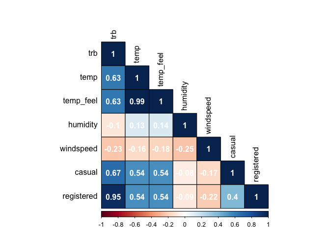<!-- -->

The total number of rides is highly correlated with the temperature and
the perceived temperature, but it does not appear to be as much linked
to the humidity and wind speed. Interestingly, it is more correlated
with registered rides than casual rides. This may be because registered
tend to do more trips (remember that trb = registered + casuals).

Let’s try to fit a quick ARDL to the data, and then deal with issues
that may arise. The model eqquation is:

trbc_ts ~ temp + hum + wind + workday

To fit an ARDL, the first step is to compute the BIC and AIC to
determine the lag order of the parameters. Models with lowest AIC/BIC
are better.

``` r
#transform objects into ts
temp <- ts(day$temp, start = c(2011), frequency = 365)
hum <- ts(day$humidity, start = c(2011), frequency = 365)
wind <- ts(day$windspeed, start = c(2011), frequency = 365)
#set the df for the ardl
dfardl <- data.frame(trbc_ts, temp, hum, wind, day$workingday)
#rename a column
names(dfardl)[names(dfardl) == "day.workingday"] <- "workday"
#find the proper ardl paramters
#why ardl? becasue y is of order 1 and at least one of x is of order 1 (temp)
library(dLagM)
#BIC
ardlBIC <- dfardl %>% 
    ardlBound(trbc_ts ~ temp + hum + wind + workday, case = 3, p = NULL,
                       remove = NULL, autoOrder = FALSE, ic = "BIC" , max.p = 4, max.q = 6, 
                       ECM = TRUE, stability = TRUE)
```

    ##   
    ## Orders being calculated with max.p = 4 and max.q = 6 ...
    ## 
    ## Autoregressive order: 7 and p-orders: 4 1 4 1 
    ## ------------------------------------------------------ 
    ## 
    ##  Breusch-Godfrey Test for the autocorrelation in residuals:
    ## 
    ##  Breusch-Godfrey test for serial correlation of order up to 1
    ## 
    ## data:  modelFull$model
    ## LM test = 1.6962, df1 = 1, df2 = 701, p-value = 0.1932
    ## 
    ## ------------------------------------------------------ 
    ## 
    ##  Ljung-Box Test for the autocorrelation in residuals:
    ## 
    ##  Box-Ljung test
    ## 
    ## data:  res
    ## X-squared = 0.24179, df = 1, p-value = 0.6229
    ## 
    ## ------------------------------------------------------ 
    ## 
    ##  Breusch-Pagan Test for the homoskedasticity of residuals:
    ## 
    ##  studentized Breusch-Pagan test
    ## 
    ## data:  modelFull$model
    ## BP = 48.631, df = 21, p-value = 0.0005639
    ## 
    ## The p-value of Breusch-Pagan test for the homoskedasticity of residuals:  0.0005638613 < 0.05!
    ## ------------------------------------------------------ 
    ## 
    ##  Shapiro-Wilk test of normality of residuals:
    ## 
    ##  Shapiro-Wilk normality test
    ## 
    ## data:  modelFull$model$residual
    ## W = 0.96131, p-value = 6.824e-13
    ## 
    ## The p-value of Shapiro-Wilk test normality of residuals:  6.824304e-13 < 0.05!
    ## ------------------------------------------------------ 
    ## 
    ##  PESARAN, SHIN AND SMITH (2001) COINTEGRATION TEST 
    ## 
    ##  Observations: 730 
    ##  Number of Regressors (k): 4 
    ##  Case: 3 
    ## 
    ##  ------------------------------------------------------ 
    ##  -                       F-test                       - 
    ##  ------------------------------------------------------ 
    ##                  <------- I(0) ------------ I(1) -----> 
    ##  10% critical value       2.45            3.52 
    ##  5% critical value        2.86            4.01 
    ##  1% critical value        3.74            5.06 
    ##  
    ## 
    ##  F-statistic = 7.48523593407873 
    ##   
    ##  ------------------------------------------------------ 
    ##  F-statistic note: Asymptotic critical values used. 
    ##  
    ## ------------------------------------------------------ 
    ## 
    ##  Ramsey's RESET Test for model specification:
    ## 
    ##  RESET test
    ## 
    ## data:  modelECM$model
    ## RESET = 6.5785, df1 = 2, df2 = 704, p-value = 0.001477
    ## 
    ## the p-value of RESET test:  0.00147692 < 0.05!
    ## ------------------------------------------------------

    ## ------------------------------------------------------ 
    ## Error Correction Model Output: 
    ## 
    ## Time series regression with "ts" data:
    ## Start = 7, End = 730
    ## 
    ## Call:
    ## dynlm(formula = as.formula(model.text), data = data)
    ## 
    ## Residuals:
    ##     Min      1Q  Median      3Q     Max 
    ## -3930.2  -322.0    45.8   391.2  2316.2 
    ## 
    ## Coefficients:
    ##               Estimate Std. Error t value Pr(>|t|)    
    ## (Intercept)  7.743e+02  1.283e+02   6.035 2.57e-09 ***
    ## ec.1        -6.714e-02  1.094e-02  -6.135 1.42e-09 ***
    ## dtemp.t      4.509e+03  5.090e+02   8.859  < 2e-16 ***
    ## dtemp.1      5.393e+02  5.282e+02   1.021  0.30755    
    ## dtemp.2     -1.023e+03  5.216e+02  -1.962  0.05018 .  
    ## dtemp.3      1.095e+03  5.172e+02   2.118  0.03456 *  
    ## dhum.t      -3.352e+03  2.106e+02 -15.912  < 2e-16 ***
    ## dwind.t     -3.116e+03  3.398e+02  -9.169  < 2e-16 ***
    ## dwind.1     -1.308e+03  4.293e+02  -3.046  0.00240 ** 
    ## dwind.2     -4.247e+01  4.020e+02  -0.106  0.91589    
    ## dwind.3     -8.402e+02  3.616e+02  -2.324  0.02042 *  
    ## dworkday.t   1.446e+02  5.362e+01   2.696  0.00718 ** 
    ## dtrbc_ts.1  -4.815e-01  3.273e-02 -14.712  < 2e-16 ***
    ## dtrbc_ts.2  -2.538e-01  3.659e-02  -6.937 9.07e-12 ***
    ## dtrbc_ts.3  -2.388e-01  3.655e-02  -6.534 1.22e-10 ***
    ## dtrbc_ts.4  -2.237e-01  3.492e-02  -6.405 2.74e-10 ***
    ## dtrbc_ts.5  -1.847e-01  3.388e-02  -5.452 6.90e-08 ***
    ## dtrbc_ts.6  -4.983e-02  3.024e-02  -1.648  0.09986 .  
    ## ---
    ## Signif. codes:  0 '***' 0.001 '**' 0.01 '*' 0.05 '.' 0.1 ' ' 1
    ## 
    ## Residual standard error: 693.1 on 706 degrees of freedom
    ## Multiple R-squared:  0.5291, Adjusted R-squared:  0.5177 
    ## F-statistic: 46.66 on 17 and 706 DF,  p-value: < 2.2e-16
    ## 
    ## ------------------------------------------------------ 
    ## Long-run coefficients: 
    ##     trbc_ts.1        temp.1         hum.1        wind.1     workday.1 
    ## -6.713555e-02  4.157034e+02 -9.345052e+02 -1.471675e+03  2.859797e+02 
    ## 

``` r
#4,1,4,1
#AIC
ardlAIC <- dfardl %>% 
  ardlBound(trbc_ts ~ temp + hum + wind + workday, case = 3, p = NULL,
            remove = NULL, autoOrder = FALSE, ic = "AIC" , max.p = 4, max.q = 6, 
            ECM = TRUE, stability = TRUE)
```

    ##   
    ## Orders being calculated with max.p = 4 and max.q = 6 ...
    ## 
    ## Autoregressive order: 7 and p-orders: 4 1 4 1 
    ## ------------------------------------------------------ 
    ## 
    ##  Breusch-Godfrey Test for the autocorrelation in residuals:
    ## 
    ##  Breusch-Godfrey test for serial correlation of order up to 1
    ## 
    ## data:  modelFull$model
    ## LM test = 1.6962, df1 = 1, df2 = 701, p-value = 0.1932
    ## 
    ## ------------------------------------------------------ 
    ## 
    ##  Ljung-Box Test for the autocorrelation in residuals:
    ## 
    ##  Box-Ljung test
    ## 
    ## data:  res
    ## X-squared = 0.24179, df = 1, p-value = 0.6229
    ## 
    ## ------------------------------------------------------ 
    ## 
    ##  Breusch-Pagan Test for the homoskedasticity of residuals:
    ## 
    ##  studentized Breusch-Pagan test
    ## 
    ## data:  modelFull$model
    ## BP = 48.631, df = 21, p-value = 0.0005639
    ## 
    ## The p-value of Breusch-Pagan test for the homoskedasticity of residuals:  0.0005638613 < 0.05!
    ## ------------------------------------------------------ 
    ## 
    ##  Shapiro-Wilk test of normality of residuals:
    ## 
    ##  Shapiro-Wilk normality test
    ## 
    ## data:  modelFull$model$residual
    ## W = 0.96131, p-value = 6.824e-13
    ## 
    ## The p-value of Shapiro-Wilk test normality of residuals:  6.824304e-13 < 0.05!
    ## ------------------------------------------------------ 
    ## 
    ##  PESARAN, SHIN AND SMITH (2001) COINTEGRATION TEST 
    ## 
    ##  Observations: 730 
    ##  Number of Regressors (k): 4 
    ##  Case: 3 
    ## 
    ##  ------------------------------------------------------ 
    ##  -                       F-test                       - 
    ##  ------------------------------------------------------ 
    ##                  <------- I(0) ------------ I(1) -----> 
    ##  10% critical value       2.45            3.52 
    ##  5% critical value        2.86            4.01 
    ##  1% critical value        3.74            5.06 
    ##  
    ## 
    ##  F-statistic = 7.48523593407873 
    ##   
    ##  ------------------------------------------------------ 
    ##  F-statistic note: Asymptotic critical values used. 
    ##  
    ## ------------------------------------------------------ 
    ## 
    ##  Ramsey's RESET Test for model specification:
    ## 
    ##  RESET test
    ## 
    ## data:  modelECM$model
    ## RESET = 6.5785, df1 = 2, df2 = 704, p-value = 0.001477
    ## 
    ## the p-value of RESET test:  0.00147692 < 0.05!
    ## ------------------------------------------------------

    ## ------------------------------------------------------ 
    ## Error Correction Model Output: 
    ## 
    ## Time series regression with "ts" data:
    ## Start = 7, End = 730
    ## 
    ## Call:
    ## dynlm(formula = as.formula(model.text), data = data)
    ## 
    ## Residuals:
    ##     Min      1Q  Median      3Q     Max 
    ## -3930.2  -322.0    45.8   391.2  2316.2 
    ## 
    ## Coefficients:
    ##               Estimate Std. Error t value Pr(>|t|)    
    ## (Intercept)  7.743e+02  1.283e+02   6.035 2.57e-09 ***
    ## ec.1        -6.714e-02  1.094e-02  -6.135 1.42e-09 ***
    ## dtemp.t      4.509e+03  5.090e+02   8.859  < 2e-16 ***
    ## dtemp.1      5.393e+02  5.282e+02   1.021  0.30755    
    ## dtemp.2     -1.023e+03  5.216e+02  -1.962  0.05018 .  
    ## dtemp.3      1.095e+03  5.172e+02   2.118  0.03456 *  
    ## dhum.t      -3.352e+03  2.106e+02 -15.912  < 2e-16 ***
    ## dwind.t     -3.116e+03  3.398e+02  -9.169  < 2e-16 ***
    ## dwind.1     -1.308e+03  4.293e+02  -3.046  0.00240 ** 
    ## dwind.2     -4.247e+01  4.020e+02  -0.106  0.91589    
    ## dwind.3     -8.402e+02  3.616e+02  -2.324  0.02042 *  
    ## dworkday.t   1.446e+02  5.362e+01   2.696  0.00718 ** 
    ## dtrbc_ts.1  -4.815e-01  3.273e-02 -14.712  < 2e-16 ***
    ## dtrbc_ts.2  -2.538e-01  3.659e-02  -6.937 9.07e-12 ***
    ## dtrbc_ts.3  -2.388e-01  3.655e-02  -6.534 1.22e-10 ***
    ## dtrbc_ts.4  -2.237e-01  3.492e-02  -6.405 2.74e-10 ***
    ## dtrbc_ts.5  -1.847e-01  3.388e-02  -5.452 6.90e-08 ***
    ## dtrbc_ts.6  -4.983e-02  3.024e-02  -1.648  0.09986 .  
    ## ---
    ## Signif. codes:  0 '***' 0.001 '**' 0.01 '*' 0.05 '.' 0.1 ' ' 1
    ## 
    ## Residual standard error: 693.1 on 706 degrees of freedom
    ## Multiple R-squared:  0.5291, Adjusted R-squared:  0.5177 
    ## F-statistic: 46.66 on 17 and 706 DF,  p-value: < 2.2e-16
    ## 
    ## ------------------------------------------------------ 
    ## Long-run coefficients: 
    ##     trbc_ts.1        temp.1         hum.1        wind.1     workday.1 
    ## -6.713555e-02  4.157034e+02 -9.345052e+02 -1.471675e+03  2.859797e+02 
    ## 

``` r
#4,1,4,1
```

Both the AIC and the BIC suggests an order of 4,1,4,1,0 for the
variables. The next step is to estimate the ARDL parameters by using
these lag orders.

``` r
library(ARDL)
ardl <- ardl(trbc_ts ~ temp + hum + wind + workday, data=dfardl, order = c(1,2,2,1,0))
summary(ardl)
```

    ## 
    ## Time series regression with "ts" data:
    ## Start = 3, End = 731
    ## 
    ## Call:
    ## dynlm::dynlm(formula = full_formula, data = data, start = start, 
    ##     end = end)
    ## 
    ## Residuals:
    ##     Min      1Q  Median      3Q     Max 
    ## -4531.2  -424.8    -5.7   423.8  3548.4 
    ## 
    ## Coefficients:
    ##                 Estimate Std. Error t value Pr(>|t|)    
    ## (Intercept)    7.321e+02  2.543e+02   2.879 0.004111 ** 
    ## L(trbc_ts, 1)  8.348e-01  2.026e-02  41.214  < 2e-16 ***
    ## temp           4.944e+03  5.424e+02   9.115  < 2e-16 ***
    ## L(temp, 1)    -6.018e+03  7.417e+02  -8.114 2.12e-15 ***
    ## L(temp, 2)     2.076e+03  5.129e+02   4.049 5.71e-05 ***
    ## hum           -3.272e+03  2.544e+02 -12.864  < 2e-16 ***
    ## L(hum, 1)      3.315e+03  2.866e+02  11.566  < 2e-16 ***
    ## L(hum, 2)     -5.999e+02  2.477e+02  -2.422 0.015698 *  
    ## wind          -3.120e+03  4.130e+02  -7.554 1.28e-13 ***
    ## L(wind, 1)     1.551e+03  4.544e+02   3.414 0.000676 ***
    ## workday        2.500e+02  6.280e+01   3.981 7.56e-05 ***
    ## ---
    ## Signif. codes:  0 '***' 0.001 '**' 0.01 '*' 0.05 '.' 0.1 ' ' 1
    ## 
    ## Residual standard error: 775.3 on 718 degrees of freedom
    ## Multiple R-squared:  0.8385, Adjusted R-squared:  0.8362 
    ## F-statistic: 372.7 on 10 and 718 DF,  p-value: < 2.2e-16

All the parameters and their respective lags appears to be statistically
significant with an high level. To evaluate the model, it could be
useful to plot the fitted values against the real values.

<!-- -->

The model catches fairly good the movements of the real data even though
it has some higher peaks and lower values. The main issue, however, is
with point 67 and 68 that appears to be way larger than the actual
values. Especially point 68 is negative while the number of ride bikes
can go below 0. This may be a consequence of some outliers in the
independent variables. As regards, the approach is to detect those
outliers and replace. Note that this is a step that in more precise
analysis should be performed before fitting the model. This studio
fitted beforehand the ARDL just to have a quick view of the possible
issues.

``` r
# hum outliers
find_mild_out(hum) #2
```

    ## [1] 2

``` r
find_severe_out(hum) #0
```

    ## [1] 0

``` r
#temp out
find_mild_out(temp) #0
```

    ## [1] 0

``` r
find_severe_out(temp) #0
```

    ## [1] 0

``` r
#wind out
find_mild_out(wind) #13
```

    ## [1] 13

``` r
find_severe_out(wind) #0
```

    ## [1] 0

Humidity has 2 outliers while wind speed has 13. No outliers for the
temp. Now it is necessary to correct these outliers before re-setting an
ARDL model. Now let’s substitute outliers with the mean of the series
and re-fit the values.

``` r
#remove outliers from humc
library(MASS)
humc <- rem_out(hum)
windc <- rem_out(wind)
#add those to dfardl
dfardl$humc = humc
dfardl$windc = windc
```

<!-- --><!-- -->

To double check the order of the parameters, let’s compute the BIC again
to select the best model.

``` r
#compute the BIC for ARDL again
ardlBIC2 <- dfardl %>% 
  ardlBound(trbc_ts ~ temp + humc + windc, case = 4, p = NULL,
            remove = NULL, autoOrder = FALSE, ic = "BIC" , max.p = 4, max.q = 4, 
            ECM = TRUE, stability = TRUE)
```

    ##   
    ## Orders being calculated with max.p = 4 and max.q = 4 ...
    ## 
    ## Autoregressive order: 5 and p-orders: 1 1 4 
    ## ------------------------------------------------------ 
    ## 
    ##  Breusch-Godfrey Test for the autocorrelation in residuals:
    ## 
    ##  Breusch-Godfrey test for serial correlation of order up to 1
    ## 
    ## data:  modelFull$model
    ## LM test = 2.381, df1 = 1, df2 = 706, p-value = 0.1233
    ## 
    ## ------------------------------------------------------ 
    ## 
    ##  Ljung-Box Test for the autocorrelation in residuals:
    ## 
    ##  Box-Ljung test
    ## 
    ## data:  res
    ## X-squared = 0.52933, df = 1, p-value = 0.4669
    ## 
    ## ------------------------------------------------------ 
    ## 
    ##  Breusch-Pagan Test for the homoskedasticity of residuals:
    ## 
    ##  studentized Breusch-Pagan test
    ## 
    ## data:  modelFull$model
    ## BP = 52.472, df = 15, p-value = 4.718e-06
    ## 
    ## The p-value of Breusch-Pagan test for the homoskedasticity of residuals:  4.717971e-06 < 0.05!
    ## ------------------------------------------------------ 
    ## 
    ##  Shapiro-Wilk test of normality of residuals:
    ## 
    ##  Shapiro-Wilk normality test
    ## 
    ## data:  modelFull$model$residual
    ## W = 0.9655, p-value = 4.719e-12
    ## 
    ## The p-value of Shapiro-Wilk test normality of residuals:  4.719053e-12 < 0.05!
    ## ------------------------------------------------------ 
    ## 
    ##  PESARAN, SHIN AND SMITH (2001) COINTEGRATION TEST 
    ## 
    ##  Observations: 730 
    ##  Number of Regressors (k): 3 
    ##  Case: 4 
    ## 
    ##  ------------------------------------------------------ 
    ##  -                       F-test                       - 
    ##  ------------------------------------------------------ 
    ##                  <------- I(0) ------------ I(1) -----> 
    ##  10% critical value       2.97            3.74 
    ##  5% critical value        3.38            4.23 
    ##  1% critical value        4.3            5.23 
    ##  
    ## 
    ##  F-statistic = 6.69694269747361 
    ##   
    ##  ------------------------------------------------------ 
    ##  F-statistic note: Asymptotic critical values used. 
    ##  
    ## ------------------------------------------------------ 
    ## 
    ##  Ramsey's RESET Test for model specification:
    ## 
    ##  RESET test
    ## 
    ## data:  modelECM$model
    ## RESET = 13.394, df1 = 2, df2 = 712, p-value = 1.95e-06
    ## 
    ## the p-value of RESET test:  1.949897e-06 < 0.05!
    ## ------------------------------------------------------

    ## ------------------------------------------------------ 
    ## Error Correction Model Output: 
    ## 
    ## Time series regression with "ts" data:
    ## Start = 5, End = 730
    ## 
    ## Call:
    ## dynlm(formula = as.formula(model.text), data = data)
    ## 
    ## Residuals:
    ##      Min       1Q   Median       3Q      Max 
    ## -3157.37  -330.11    74.95   416.39  2301.36 
    ## 
    ## Coefficients:
    ##               Estimate Std. Error t value Pr(>|t|)    
    ## (Intercept)  5.834e+02  9.486e+01   6.150 1.29e-09 ***
    ## ec.1        -1.917e-01  3.017e-02  -6.356 3.70e-10 ***
    ## dtemp.t      5.042e+03  4.864e+02  10.366  < 2e-16 ***
    ## dhumc.t     -3.645e+03  2.114e+02 -17.238  < 2e-16 ***
    ## dwindc.t    -2.848e+03  3.538e+02  -8.049 3.50e-15 ***
    ## dwindc.1    -2.199e+03  4.295e+02  -5.121 3.92e-07 ***
    ## dwindc.2    -5.474e+02  4.090e+02  -1.338 0.181208    
    ## dwindc.3    -8.577e+02  3.571e+02  -2.402 0.016581 *  
    ## dtrbc_ts.1  -3.169e-01  3.365e-02  -9.416  < 2e-16 ***
    ## dtrbc_ts.2  -1.298e-01  3.455e-02  -3.756 0.000187 ***
    ## dtrbc_ts.3  -1.026e-01  3.341e-02  -3.069 0.002229 ** 
    ## dtrbc_ts.4  -9.229e-02  2.983e-02  -3.094 0.002050 ** 
    ## ---
    ## Signif. codes:  0 '***' 0.001 '**' 0.01 '*' 0.05 '.' 0.1 ' ' 1
    ## 
    ## Residual standard error: 697.9 on 714 degrees of freedom
    ## Multiple R-squared:  0.5171, Adjusted R-squared:  0.5097 
    ## F-statistic: 69.51 on 11 and 714 DF,  p-value: < 2.2e-16
    ## 
    ## ------------------------------------------------------ 
    ## Long-run coefficients: 
    ##    trbc_ts.1       temp.1       humc.1      windc.1 
    ##   -0.1917211 1130.6808609 -825.0527164 -429.0195116 
    ## 

Now fit the model with the given parameters (5,1,1,4) by adding also a
trend.

``` r
ardl2 <- ardl(trbc_ts ~ temp + humc + windc + trend(trbc_ts) | workday, data=dfardl, order = c(5,1,1,4))
summary(ardl2)
```

    ## 
    ## Time series regression with "ts" data:
    ## Start = 6, End = 731
    ## 
    ## Call:
    ## dynlm::dynlm(formula = full_formula, data = data, start = start, 
    ##     end = end)
    ## 
    ## Residuals:
    ##      Min       1Q   Median       3Q      Max 
    ## -3025.55  -305.92    53.46   390.44  2439.24 
    ## 
    ## Coefficients:
    ##                  Estimate Std. Error t value Pr(>|t|)    
    ## (Intercept)     4.877e+02  2.782e+02   1.753 0.080012 .  
    ## trend(trbc_ts)  8.642e-01  2.209e-01   3.912 0.000101 ***
    ## L(trbc_ts, 1)   4.914e-01  3.288e-02  14.945  < 2e-16 ***
    ## L(trbc_ts, 2)   1.947e-01  3.330e-02   5.847 7.65e-09 ***
    ## L(trbc_ts, 3)   3.049e-02  3.348e-02   0.911 0.362696    
    ## L(trbc_ts, 4)   1.200e-02  3.325e-02   0.361 0.718354    
    ## L(trbc_ts, 5)   8.710e-02  3.044e-02   2.861 0.004342 ** 
    ## temp            4.920e+03  4.907e+02  10.027  < 2e-16 ***
    ## L(temp, 1)     -3.861e+03  4.970e+02  -7.770 2.76e-14 ***
    ## humc           -3.660e+03  2.349e+02 -15.584  < 2e-16 ***
    ## L(humc, 1)      2.796e+03  2.508e+02  11.149  < 2e-16 ***
    ## windc          -2.849e+03  3.869e+02  -7.363 5.00e-13 ***
    ## L(windc, 1)     1.706e+02  4.325e+02   0.394 0.693387    
    ## L(windc, 2)     1.600e+03  4.227e+02   3.786 0.000166 ***
    ## L(windc, 3)    -3.087e+02  4.101e+02  -0.753 0.451865    
    ## L(windc, 4)     8.719e+02  3.890e+02   2.241 0.025316 *  
    ## workday         2.186e+02  5.588e+01   3.912 0.000100 ***
    ## ---
    ## Signif. codes:  0 '***' 0.001 '**' 0.01 '*' 0.05 '.' 0.1 ' ' 1
    ## 
    ## Residual standard error: 692.9 on 709 degrees of freedom
    ## Multiple R-squared:  0.8713, Adjusted R-squared:  0.8684 
    ## F-statistic: 299.9 on 16 and 709 DF,  p-value: < 2.2e-16

Interestingly, the upward trend in the total rides is relevant.
Morevoer, the past rides appears to be statistically significant up to 2
lags (i.e days) before. Moreover, they have a positive relation. As
predictable, the temperature is statistically significant both at lag0
and lag1. It is positively related to trb when it is at lag0 (the higher
the temp, the more rides) and negatively related to the temperature of
the day before (this can be a consequence of weather forecasts or the
idea that if it is really hot today, tomorrow may be cooler). Finally
both wind and humidity are relevant at lag0, and they have the expected
direction. The stronger the wind, the lower the rides since the wind
makes riding a bike become harder; while a higher humidity may point to
a rainy day, thus making the users opt for other types transportation.
Finally, as predictable, whether or not it is a working day is
statistically significant. Plotting the ARDL’s fitted values against the
real values is the best way to assess the goodness of the model.

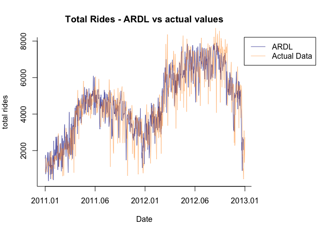<!-- -->

The model succeed both in catching the trend and the seasonality of the
data. It also seems to catch the direction of the daily movement, even
tough from time to time it anticipates them. The main issue with the
model is its estimation’s magnitude, that sometimes tend to
underestimate the real value. Let’s conside the accuracy of the model to
have a complete view of its performances.

``` r
accuracy(ardl2)
```

    ##                        ME   RMSE      MAE       MPE     MAPE      MASE
    ## Training set 2.109103e-14 684.73 504.6599 -4.336209 15.48176 0.7172778
    ##                     ACF1
    ## Training set -0.03045278

MAPE suggests that on average the ARDL prediction will be 15% off from
the real value. Since this is a model developed just to gain a better
idea of what influences the number of total rides, a margin of error of
the 15% (or around 504 bikes) is not a bad result as a starting point to
implement a dynamic pricing strategy based on different day-to-day
variables. Of course, the model could be ameliorate. The main suggestion
is, again, to re-build the model when more data will be available (5+
years). If this is the case, it will be easier to include the
seasonality into the model to achieve more accurate predictions.
Including variables that have not been considered can decrease the
margin of error too. As an example, it could be convenient to add a
rainy-day dummy variable to account for those day when it rained.
Finally, since the error terms appeared to be heteroskedastic, the model
has been re-estimated with a robust formula. The significane level,
however, did not change. Moreover, errors are not autocorrelated. The
issues is with the normality likeliness of the error distribution, since
the jarque bera test rejects it. Neverthless, this may be due to the
large sample, since in such a situation the jb test may rejects
normality even for the smallest movement from it.

``` r
library(lmtest)
library(sandwich)
dwtest(ardl2)
```

    ## 
    ##  Durbin-Watson test
    ## 
    ## data:  ardl2
    ## DW = 2.0595, p-value = 0.7458
    ## alternative hypothesis: true autocorrelation is greater than 0

``` r
#p-value > 0.05 -> not autocorrelation among residuals
#START FROM HERE
#heterosked
bptest(ardl2) #H0 is homoskedasticity
```

    ## 
    ##  studentized Breusch-Pagan test
    ## 
    ## data:  ardl2
    ## BP = 77.51, df = 16, p-value = 4.661e-10

``` r
#heteroskedasticity
#re-estimate the model with robust se
ardlrob<- coeftest(ardl2, vcov = sandwich)
```

## Findings and Insights

First of all, let’s discuss about the findings about the total rides as
a time series. There are 2 main things to grasp: it has a seasonality of
365 days (even though at the moment this seasonality has just 2 periods)
and it is of order I(1), i.e it is a non-stationary ts that can be made
stationary by first-differencing. Then, there are different insights
that come from this analysis:

- The number of rides has risen from 2011 to 2012. This may be due to an
  increase of available bikes.
- The seasons that shows higher rides is Summer, while the one with the
  lowest is winter. As such, an increase price during the summer period
  and a lower price in the winter period may be good strategy to profit
  more, since people will probably ride a bike on summer even with
  higher prices while in the coolest month lower price may attract more
  customers.
- Clear day are the one when users ride more. The number of riders
  drastically decreases when it snows, as predictable. As such, in snowy
  days re-organize the bikes by splitting equally them among different
  docks may be a good strategy to ensure the availability in every dock
  when the bikes are more requested.
- Temperature and number of rides appears to have a positive relations.
  However, number of rides tend to cluster when the normalized humidity
  is higher than 0.5 and wind speed is lower than 0.4.
- The best model to predict future values is the SARIMA(6,1,1)(0,1,0).
  It predicts a slow recover from the shrink in rides that December
  experienced. Highly variability among days remain. To further push
  this upward trend, a low price may be the right choice. In this case,
  the low price could attract more customers that will pushing even more
  upward the number of rides. Based on previous year, it could be
  suggested to increase again the price around the end of February/half
  of March to better exploit the upward trend. Consider then re-lowering
  the prices by the end of October to try to stop the (likely) downard
  trend that may come.
- It is suggested to do maintenance intervention in the months of
  November, December and January when the demand for bikes is at its
  lowest level in order to avoid disruption of the service when customer
  need it more.
- To understand the high day-to-day volatility, an ARDL(5,1,1,4) with a
  dummy and trend was developed. It showed that temperature, wind speed,
  humidity and whether or not it is a working day are all statistically
  significant variables in determining the daily number of rides.
  Developing a strategy based also on this considerations may increase
  more the chances of placing the right price at the right time. For
  example, Days with strong wind may be perfect to re-organize the bike
  positioning, while days with the warmer temperature may be the perfect
  occasions to offer daily ride buses (i.e discounted price on the 3rd
  rides if you do all three rides in the same day and so on) to attract
  even more customers.

## Models’ limits and improvements

Models have some room for improvement. Especially:

- Repeat this study when more data is available will surely improve the
  forecasts’ accuracy.
- Not-predictable event may happens. If it is the case, the model could
  fail in forecasting the number of rides in that period.
- A GARCH model could be added to ARIMA in order to model the variance
  of the residuals and have a better view of the situation.
- More variables could be added to the ARDL model based on what the
  business is interested into. Be aware of avoiding the problem of
  multicollinearity.
- Other model could have been developed, like an OLS estimator.
